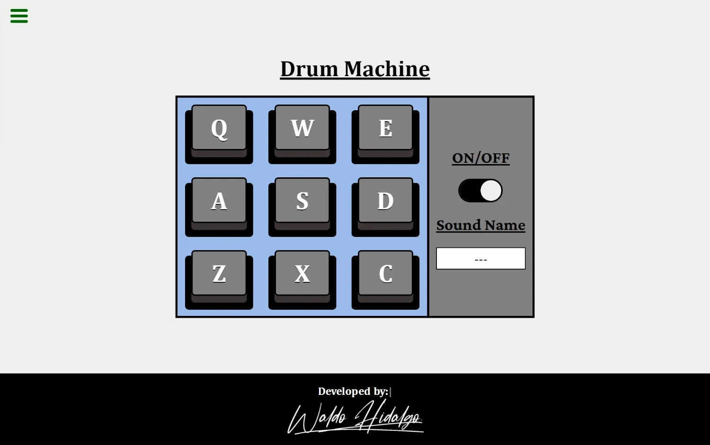

# Project Drum Machine

Repositorio con el código solución al proyecto requisito número 3 para obtener la certificación **Front End Development Libraries**.

## Tabla de Contenidos

- [Project Drum Machine](#project-drum-machine)
  - [Tabla de Contenidos](#tabla-de-contenidos)
  - [Librerias Utilizadas](#librerias-utilizadas)
  - [Requisitos](#requisitos)
  - [Screenshots](#screenshots)
    - [Proyecto cumple con todos los requsitos](#proyecto-cumple-con-todos-los-requsitos)
    - [Drum Machine On](#drum-machine-on)
    - [Drum Machine Off](#drum-machine-off)
    - [Drum Machine 100% Responsive](#drum-machine-100-responsive)

## Librerias Utilizadas

| Tecnologías Utilizadas |
| ---------------------- |
| Nextjs 12              |
| React 17               |
| ReactDom 17            |
| Typewriter-effect      |

## Requisitos

## Screenshots

### Proyecto cumple con todos los requsitos

### Drum Machine On

### Drum Machine Off

### Drum Machine 100% Responsive

